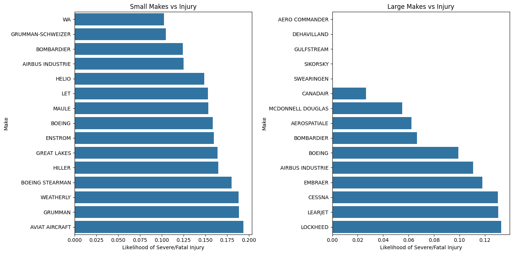
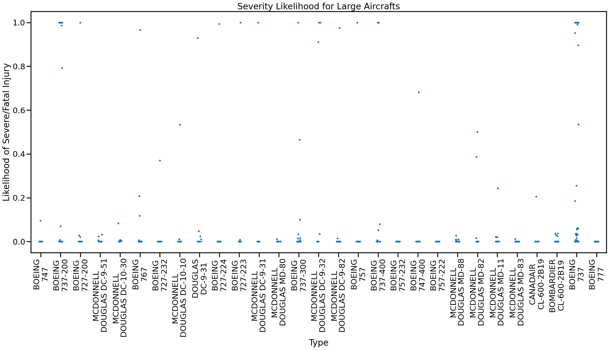
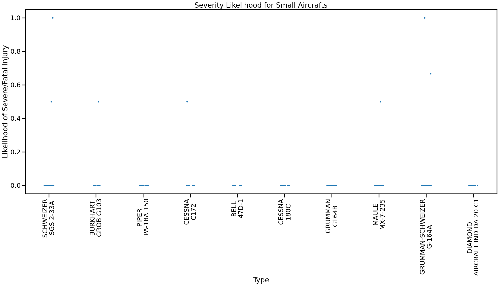
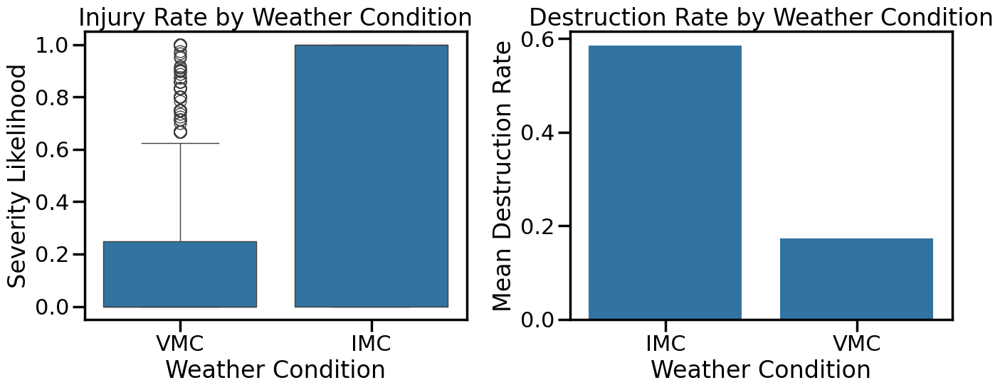
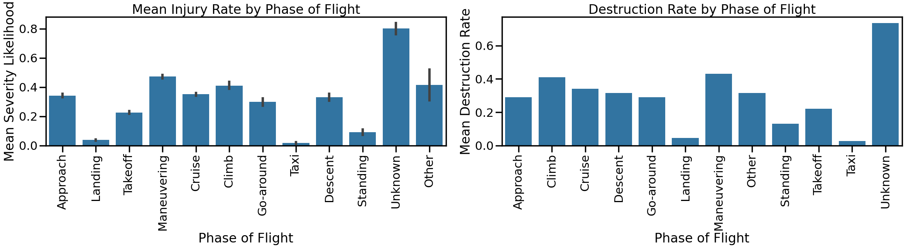

# Aviation Accident Analysis

## Key Graphs:

## Key Findings:

**Small Aircraft:**
Among small aircraft makes, the safeset makes show injury rates clustered near zero, meaning the majority of recorded accidents for these manufacturers produced no serious passenger harm. Makes such as WA and GRUMMAN-SCHWEIZER can be confidently recommended due to the higher accident sample size and low injury and destruction rates. However, large aircrafts have even lower injury/destruction rates, with even more samples.

**Large Aircraft:**
The large aircraft sample is considerably smaller (~800 incidents vs. ~47,000 for small), so results require more caution. Major commercial manufacturers consistently show low injury and destruction rates. The strip plot distributions for large makes tend to have a lower variance than small aircraft, meaning that the outcome is more consistent. Both BOEING and MCDONNELL DOUGLAS have much lower injury likelihood than any small makes, and have many more data points.

**Small Aircraft Types:**
Individual airplane types is a less reliable measure, as the number of accidents is significantly smaller. While BOEING and MCDONNELL appeared consistently in large aircraft types, small aircraft types have no consistently safe make. That said, the top 10 small aircraft types have similar injury rates, destructions rates, and deviation as the large aircraft types, indicating that the safest small aircrafts are as safe as the safest large aircrafts.

**Large Aircraft Types:**
BOEING and MCDONNELL make up most of the top 10, which aligns with the safest makes. Some rows have 0% injury rate and 0% deviation with 10+ accidents, which increases confidence.

**Recommendation for Client:**
BOEING is the recommendation, as its low injury rate and low destruction rate persists across different models, making it a good all-around pick. For a small aircraft, there is no consistently safe make, but specific types are just as safe, such as the BELL 47D-1.
